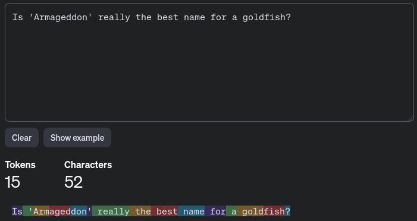
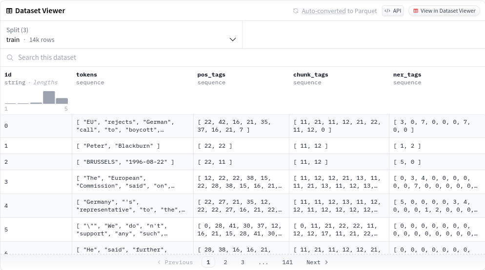

# GKXXXX Data Science "NER Classification" (POSA)

## Data Science "NER Classification" - Taskdescription

### Einführung

Es ist empfehlenswert, dass unten verlinkte [Tutorial](https://huggingface.co/learn/nlp-course/chapter7/2) als Vorlage und Hilfestellung zu verwenden.

### Ziele

Das Ziel ist es, das Sprachmodell `bert-base-cased` für Named Entity Recognition (NER) zu feintunen. Im Endeffekt soll das Modell zwischen Personen, Organisationen, Orten und MISC klassifizieren können. Dazu soll der [conllpp-Datensatz](https://huggingface.co/datasets/conllpp) verwendet werden.

### Voraussetzungen

- Kenntnis von Markdown, LaTeX und Grundkenntnisse in R und Python
- funktionstüchtige Installation von R, RStudio, Python auf eurem Rechner, virtueller Maschine etc.
- Kenntnis von grundlegenden Methoden der Wahrscheinlichkeitstheorie.
- Die Verwendung von Jupyter Notebooks ist empfehlenswert, aber nicht erforderlich.

Außerdem werden folgende Python-Libraries benötigt:

```shell
pip install torch --index-url https://download.pytorch.org/whl/cpu  # Wenn eine CPU verwendet wird und keine NVIDIA-GPU vorhanden ist
pip install torch  # Wenn eine NVIDIA-GPU vorhanden ist
pip install datasets transformers seqeval numpy
```

### Hintergrundwissen & Code-Snippets

#### Tokenization

Einer der elementarsten Konzepte bei Sprachmodellen ist die sogenannte *Tokenization*. Im Hintergrund können diese Modelle (dazu zählen BERT, Mistral, GPT etc.) nicht direkt ganze Sätze verarbeiten - diese müssen in kleinere Teile zerlegt werden. Eine Möglichkeit wäre (so wie wir es in der Spalte `tokens` gesehen haben), die Sätze in einzelne Wörter zu zerlegen. In der Praxis wird das aber nicht gemacht, da es zu viele Wörter gibt und die Modelle dann zu groß werden. Stattdessen werden die Sätze in noch kleinere Teile zerlegt, den sogenannten *Tokens*. Diese bestehen meistens aus 3-4 Zeichen. Um uns das besser vorstellen zu können, können wir uns den Tokenizer von GPT-4 anschauen (Link: https://platform.openai.com/tokenizer):



Hier wurde unser Beispielsatz in 15 Tokens zerlegt, welche farbig markiert sind.

#### Trainieren von NER-Modellen

Um Modelle für NER zu trainieren, sind eigene Datensätze notwendig. Glücklicherweise bietet die Plattform HuggingFace eine Vielzahl an Datensätzen dafür an. Verwendet für diese Aufgabe am besten den Datensatz `conllpp` (https://huggingface.co/datasets/conllpp). Dieser sieht wie folgt aus:



Wir sehen hier mehrere Spalten. Die Spalte `tokens` speichert die einzelnen Sätze, welche schon im Vorhinein getrennt und mit den entsprechenden NER-Tags versehen worden sind. Diese finden sich in der Spalte `ner_tags`. Uns fällt auf, dass die Arrays aus `ner_tags` und `tokens` die gleiche Länge haben, da *jedem* Token ein NER-Tag manuell zugewiesen worden ist. Ist einem Wort kein spezielles NER-Tag zugewiesen worden, so bekommt es das Tag `0`. Dies ist für euch später beim Coden wichtig, da dieses Konzept fürs Training berücksichtigt werden muss.

Des Weiteren ist der Datensatz in drei Teile aufgeteilt: `train`, `validation` und `test` (per Dropdown auswählbar). Wie die Namen schon verraten, werden wir später mit dem Trainingsdatensatz das Modell *trainieren* und mit dem Validierungsdatensatz das Modell *evaluieren*. Schließlich wollen wir unser Modell auch auf neue Daten testen, die es noch nie vorher gesehen hat. Das gibt uns ein Gefühl dafür, wie gut unser Modell auf neue Daten reagiert (und gibt uns gleichzeitig auch Auskunft darüber, ob wir etwas beim Training falsch gemacht haben) 

Die Zahlen, die in der Spalte `ner_tags` eingetragen sind, entsprechenden den Indezes der obigen Liste (`names`). Diese NER-Tags sind nach dem BIO-Format getaggt (wird im Tutorial weiter erläutert). Was wir auch sehen, ist, dass in diesem Datensatz offenbar "nur" nach Personen, Organisationen, Orten und MISC (miscellaneous) getaggt ist (andere Datensätze haben vielleicht mehr und andere Tags). Das ist für diese Aufgabe ausreichend. Oben haben wir gesehen, dass manche Wörter so lang sind, dass sie in zwei oder mehr Teile vom Tokenizer aufgeteilt werden müssen. Wird ein Wort in zwei oder mehr Teile aufgeteilt, so wird das erste Token mit `B-` getaggt und alle weiteren mit `I-`.

#### Code-Snippets

Verwendet die folgenden Code-Snippets, um euer Modell zu trainieren (Verständnis der Code-Snippets ist nicht notwendig):

```python
def tokenize_and_align_labels(examples):
    tokenized_inputs = tokenizer(examples["tokens"], truncation=True, is_split_into_words=True)

    labels = []
    for idx, label in enumerate(examples["ner_tags"]):
        word_ids = tokenized_inputs.word_ids(batch_index=idx)
        previous_word_idx = None
        label_ids = []
        for word_idx in word_ids:
            if word_idx is None or word_idx == previous_word_idx:
                label_ids.append(-100)
            else:
                label_ids.append(label[word_idx])
            previous_word_idx = word_idx
        labels.append(label_ids)

    tokenized_inputs["labels"] = labels
    return tokenized_inputs

dataset_encoded = dataset.map(tokenize_and_align_labels, batched=True, remove_columns=["tokens", "pos_tags", "chunk_tags", "ner_tags"])
```

Das obige Snippet ist dafür gedacht, die Daten zu tokenizen und die Labels zu alignen. Das bedeutet, dass die Labels den Tokens richtig zugeordnet werden. Dies ist wichtig, da die Sätze zum Trainieren in Tokens zerlegt werden und die Labels den Tokens zugeordnet werden müssen.

Des Weiteren soll der F1-Score während des Trainings berechnet werden. Die Methode dafür kann von unten direkt kopiert und beim `Trainer`-Konsruktor mitgegeben werden:

```python
import numpy as np
from seqeval.metrics import f1_score

def compute_metris(p):
    predictions, labels = p
    predictions = np.argmax(predictions, axis=2)

    batch_size, seq_len = predictions.shape
    labels_list, predictions_list = [], []

    for batch_idx in range(batch_size):
        example_labels, example_predictions = [], []
        for seq_idx in range(seq_len):
            if labels[batch_idx, seq_idx] != -100:
                example_labels.append(index2tag[labels[batch_idx, seq_idx]])
                example_predictions.append(index2tag[predictions[batch_idx, seq_idx]])

        labels_list.append(example_labels)
        predictions_list.append(example_predictions)

    return {
        "f1": f1_score(labels_list, predictions_list),
    }
```

### Aufgabe

Das Sprachmodell Bert soll mittels dem [conllpp-Datensatz](https://huggingface.co/datasets/conllpp) auf Named Entity Recognition gefeintuned werden. Das fertige Modell soll dabei Personen, Organisationen, Orte und MISC klassifizieren können. Gehe dabei wie folgt vor:

1. Lade den [conllpp-Datensatz](https://huggingface.co/datasets/conllpp) aus dem HuggingFace-Repository und den Tokenizer für das Sprachmodell `bert-base-cased` in deinem Notebook herunter.
2. Lade das Sprachmodell `bert-base-cased` herunter. Achtung: Die Anzahl der NER-TAGS und die Zuordnung von den NER-TAGS zu den Indezes und umgekehrt müssen beim Laden des Modells mitgegeben werden.
3. Erstelle eine Funktion `tokenize_and_align_labels` wie im Tutorial. Diese soll im Endeffekt (In Kombination mit der Funtion `map`) den gesamten Datensatz tokenizen. Zusätzlich soll die Methode Labels (=NER-TAGS) und den entsprechenden Tokens zuweisen. Da wir Tokens klassifizieren, und ein Wort oft in mehrere Tokens aufgeteilt wird, müssen wir auch zwischen dem ersten Token eines Wort und den anderen unterscheiden. Das ist wegen der Fehlerberechnung notwendig, da wir nicht mehrere Tokens desselben Worts berücksichtigen wollen. Deshalb muss die Funktion auch diese Vorgehensweise implementieren.
4. Erstelle einen Data Collator, der dafür sorgt, dass jeder Input im selben Batch dieselbe Länge hat.
5. Erstelle die Fehlerfunktion.
6. Trainiere das Modell mittels der `Trainer`-Klasse. Je nach dem, ob man eine NVIDIA-Grafikkarte besitzt oder nicht, ist es empfehlenswert, mit den *Hyperparametern* `learning_rate`, `batch_size` und `num_train_epochs` herumzuspielen.
7. Teste dein Modell mit einer *pipeline* aus der *transformers*-Library.

### Abgabe

Das Protokoll ist als PDF-Dokument und Markdown-File mit ausführbarem Code abzugeben.

### Bewertung

Gruppengrösse: 1 Person

### Anforderungen überwiegend erfüllt

- Aktuelle Markdown- oder LaTeX-Protokollvorlage aus Github bzw. Moodle verwendet
- Grundlegende Beschreibung aller wichtigen Begriffe und Methoden
- Dokumentation aller Arbeitsschritte

### Anforderungen vollständig erfüllt

- Erklärung der einzelnen Trainingsparameter (Hyperparameter) wie Learning Rate, Batch Size etc. und deren Auswirkungen
- Verbale Beschreibung und Erklärung aller angeführter Begriffe und deren Anwendung in konkreten Beispielen in vollständigen deutschen Sätzen
- Funktionierendes NER-Modell

### Quellen

https://huggingface.co/learn/nlp-course/chapter7/2
